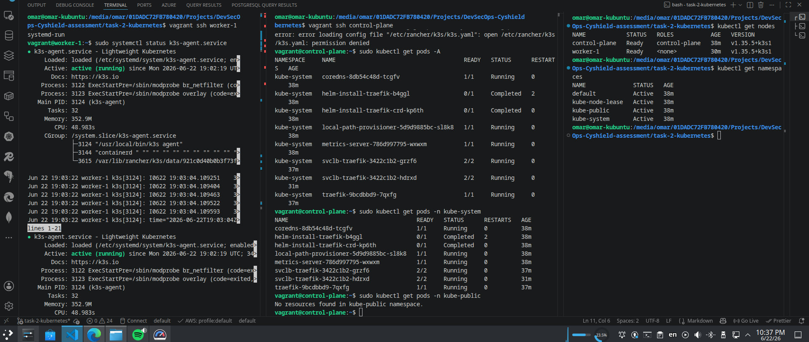

# Task 2 — Cluster Bootstrapping (Vagrant + KVM/libvirt + k3s)

## Overview

A self-managed Kubernetes cluster provisioned entirely from files in this repo.

| Layer | Tool |
|---|---|
| Hypervisor | KVM / libvirt (QEMU) |
| VM provisioner | Vagrant + `vagrant-libvirt` plugin |
| Kubernetes distro | k3s (lightweight, single-binary) |
| OS | Ubuntu 22.04 |

**Topology:** 1 control-plane node + 1 worker node, on a host-only private network (`192.168.56.0/24`).

---

## Phase 1 — Install KVM/libvirt

```bash
sudo apt update
sudo apt install -y \
  qemu-kvm \
  libvirt-daemon-system \
  libvirt-clients \
  virtinst \
  bridge-utils
```

---

## Phase 2 — Install Vagrant

```bash
wget -qO- https://apt.releases.hashicorp.com/gpg \
  | sudo gpg --dearmor -o /usr/share/keyrings/hashicorp-archive-keyring.gpg

echo "deb [signed-by=/usr/share/keyrings/hashicorp-archive-keyring.gpg] \
https://apt.releases.hashicorp.com $(lsb_release -cs) main" \
  | sudo tee /etc/apt/sources.list.d/hashicorp.list

sudo apt update && sudo apt install -y vagrant
vagrant plugin install vagrant-libvirt
```

Verify:

```bash
vagrant --version
virsh list --all
```

---

## Phase 3 — Provision VMs

The `Vagrantfile` at the repo root defines both nodes with static IPs on a private network:

| Node | IP | Role |
|---|---|---|
| `control-plane` | `192.168.56.10` | k3s server |
| `worker-1` | `192.168.56.11` | k3s agent |

```bash
vagrant up
```

Check VM status:

```bash
vagrant global-status
```

Expected output:

```
id       name          provider state   directory
3b79019  worker-1      libvirt  running /path/to/task-2-kubernetes
94005a4  control-plane libvirt  running /path/to/task-2-kubernetes
```

---

## Phase 4 — Install k3s on the control-plane

```bash
vagrant ssh control-plane

# install k3s server, binding the API to the private network IP only
curl -sfL https://get.k3s.io | \
  INSTALL_K3S_EXEC="--bind-address=192.168.56.10 --advertise-address=192.168.56.10 --node-ip=192.168.56.10" \
  sh -

# retrieve the join token for the worker
sudo cat /var/lib/rancher/k3s/server/node-token
```

---

## Phase 5 — Join the worker node

```bash
vagrant ssh worker-1

curl -sfL https://get.k3s.io | \
  K3S_URL=https://192.168.56.10:6443 \
  K3S_TOKEN='<TOKEN>' \
  sh -
```

Verify from the control-plane:

```bash
sudo kubectl get nodes
```

Expected:

```
NAME            STATUS   ROLES           AGE   VERSION
control-plane   Ready    control-plane   Xm    v1.35.x+k3s1
worker-1        Ready    <none>          Xm    v1.35.x+k3s1
```

---

## Phase 6 — Configure local kubectl access

Copy the kubeconfig from the control-plane, replacing the loopback address with the private network IP so it is accessible from the host machine:

```bash
# on control-plane
sudo cat /etc/rancher/k3s/k3s.yaml
```



Replace `127.0.0.1` with `192.168.56.10` in the copied file, then:

```bash
# on host
export KUBECONFIG=~/.kube/k3s-config
kubectl get nodes
```

---

## API Server Access Restriction

> **Requirement:** Access to the Kubernetes API server must be restricted to a specific allowed IP/CIDR.

This is achieved at three layers:

### Layer 1 — Private network isolation (Vagrantfile)

The `Vagrantfile` places both VMs on a **host-only private network** (`192.168.56.0/24`). This network is not routable to or from the internet — only the host machine can reach it.

```ruby
node.vm.network "private_network", ip: "192.168.56.10"
```

The host machine gets the gateway address `192.168.56.1` on this bridge — this is the only external IP that can physically reach the VMs.

### Layer 2 — k3s API server bind address

k3s is installed with explicit flags that bind the API server **only** to the private network interface:

```bash
--bind-address=192.168.56.10      # listen on this IP only (not 0.0.0.0)
--advertise-address=192.168.56.10 # IP advertised to other cluster members
--node-ip=192.168.56.10           # kubelet node IP
```

The API server listens exclusively on `192.168.56.10:6443`. There is no socket open on any other interface.

### Layer 3 — UFW firewall on the control-plane node

Even with the bind address locked down, UFW provides an explicit, auditable rule that allowlists the host machine and drops everything else on port 6443.

Run these commands on the control-plane node after k3s is installed:

```bash
# ensure SSH stays open first (avoid locking yourself out)
sudo ufw allow ssh

# allow the API port only from the host machine
sudo ufw allow from 192.168.56.1 to any port 6443 proto tcp

# deny port 6443 from any other source
sudo ufw deny 6443

# enable the firewall
sudo ufw --force enable

# verify the ruleset
sudo ufw status verbose
```

Expected output:

```
Status: active

To                         Action      From
--                         ------      ----
22/tcp                     ALLOW IN    Anywhere
6443/tcp                   ALLOW IN    192.168.56.1
6443                       DENY IN     Anywhere
```

**Why UFW on top of the bind address?**  
`--bind-address` prevents the kernel from accepting connections on other interfaces. UFW adds a second enforcement point — if the bind address is ever changed or the service restarts with different flags, the firewall rule still blocks unauthorised access independently.

---

**Result:** the Kubernetes API (`192.168.56.10:6443`) is protected by three independent controls:

| Layer | Mechanism | What it blocks |
|---|---|---|
| 1 | Host-only private network | All internet traffic — network is not routable |
| 2 | `--bind-address=192.168.56.10` | API socket not opened on any other interface |
| 3 | UFW `allow from 192.168.56.1` | All IPs except the host machine, at the firewall level |

