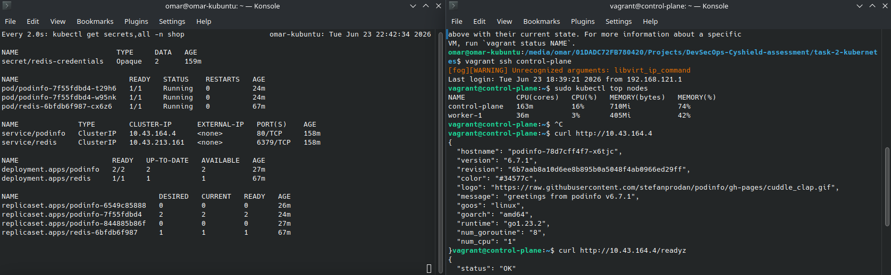
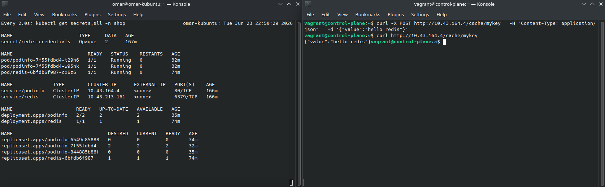
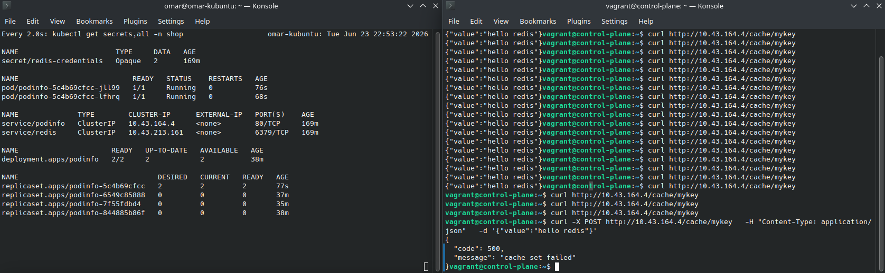

# Task 2 — Kubernetes: Two-Tier App (Redis + podinfo)

## Namespace

All resources live in a dedicated `shop` namespace to isolate workloads and avoid touching `default`.

```yaml
# namespace.yaml
apiVersion: v1
kind: Namespace
metadata:
  name: shop
```

```bash
kubectl apply -f namespace.yaml
```

---

## Secret (`redis-secret.yaml`)

Credentials are stored in a `Secret` — never hardcoded in the Deployment.  
Two keys are stored:

| Key | Purpose |
|---|---|
| `redis-password` | Passed to `redis-server --requirepass` |
| `cache-server` | Full connection URL consumed by podinfo |

`data` (base64) is used instead of `stringData` (plain text) to make the encoded nature of the values explicit.

```bash
# generate the base64 values
echo -n 'redis123' | base64
echo -n 'tcp://:redis123@redis.shop.svc.cluster.local:6379' | base64
```

```yaml
# redis-secret.yaml
apiVersion: v1
kind: Secret
metadata:
  name: redis-credentials
  namespace: shop
type: Opaque
data:
  redis-password: cmVkaXMxMjM=
  cache-server: dGNwOi8vOnJlZGlzMTIzQHJlZGlzLnNob3Auc3ZjLmNsdXN0ZXIubG9jYWw6NjM3OQ==
```

```bash
kubectl apply -f redis-secret.yaml
```

---

## Deployment (`redis-deployment.yaml`)

Scaffolded with `--dry-run` then extended:

```bash
kubectl create deployment redis --image=redis:7.2-alpine -n shop \
  --dry-run=client -o yaml > redis-deployment.yaml
```

### Key additions over the generated scaffold

**Password auth via Secret**  
`redis-server` is started with `--requirepass $(REDIS_PASSWORD)`. The env var is injected from the `redis-credentials` Secret — the password never appears in the manifest as plain text.

```yaml
command: ["redis-server", "--requirepass", "$(REDIS_PASSWORD)"]
env:
  - name: REDIS_PASSWORD
    valueFrom:
      secretKeyRef:
        name: redis-credentials
        key: redis-password
```

**Resource requests & limits** (required by the assessment brief)  
Keeps the pod schedulable and prevents it from consuming unbounded memory.

```yaml
resources:
  requests:
    cpu: 50m
    memory: 64Mi
  limits:
    cpu: 250m
    memory: 256Mi
```

**Liveness & readiness probes**  
Both run `redis-cli ping` authenticated with the password to avoid `NOAUTH` errors in logs.  
Liveness restarts a hung process; readiness gates traffic until Redis is ready to serve.

```yaml
livenessProbe:
  exec:
    command: ["sh", "-c", "redis-cli -a \"$REDIS_PASSWORD\" --no-auth-warning ping"]
  initialDelaySeconds: 5
  periodSeconds: 10
readinessProbe:
  exec:
    command: ["sh", "-c", "redis-cli -a \"$REDIS_PASSWORD\" --no-auth-warning ping"]
  initialDelaySeconds: 2
  periodSeconds: 5
```

```bash
kubectl apply -f redis-deployment.yaml
```

---

## Service (`redis-svc.yaml`)

Exposed as `ClusterIP` (the default) — reachable only from within the cluster.  
No `NodePort` or `LoadBalancer` is set, so Redis is never accessible externally.

```bash
kubectl expose deployment redis -n shop \
  --type=ClusterIP --port=6379 \
  --dry-run=client -o yaml > redis-svc.yaml
```

```yaml
# redis-svc.yaml
apiVersion: v1
kind: Service
metadata:
  name: redis
  namespace: shop
spec:
  selector:
    app: redis
  ports:
    - port: 6379
      targetPort: 6379
```

podinfo references Redis via the stable in-cluster DNS name: `redis.shop.svc.cluster.local:6379`.

```bash
kubectl apply -f redis-svc.yaml
```

---

## Deployment (`podinfo-deployment.yaml`)

[podinfo](https://github.com/stefanprodan/podinfo) is a small Go microservice used by CNCF projects (Flux, Flagger) for testing. It can run standalone or backed by Redis — when `--cache-server` is provided, it uses Redis as its cache; without it, it falls back to in-memory storage.

Scaffolded with `--dry-run` then extended:

```bash
kubectl create deployment podinfo --image=ghcr.io/stefanprodan/podinfo:6.14.0 \
  -n shop --replicas=2 --dry-run=client -o yaml > podinfo-deployment.yaml
```

### command & args

```yaml
command:
  - ./podinfo
args:
  - --level=info
  - --port=9898
  - --port-metrics=9797
  - --cache-server=$(PODINFO_CACHE_SERVER)
```

| Flag | Purpose |
|---|---|
| `./podinfo` | Explicit entrypoint — overrides the image's default CMD to make the start command clear |
| `--level=info` | Structured log level; avoids debug noise in a shared cluster |
| `--port=9898` | HTTP API & UI port (podinfo default) |
| `--port-metrics=9797` | Separate Prometheus metrics port — keeps metrics scraping isolated from app traffic |
| `--cache-server=...` | Tells podinfo to use Redis; value injected at runtime from the Secret (see below) |

### env

```yaml
env:
  - name: PODINFO_UI_COLOR
    value: "#34577c"
  - name: PODINFO_CACHE_SERVER
    valueFrom:
      secretKeyRef:
        name: redis-credentials
        key: cache-server
```

| Variable | Purpose |
|---|---|
| `PODINFO_UI_COLOR` | Cosmetic — sets the UI background colour so replicas are visually identifiable |
| `PODINFO_CACHE_SERVER` | Holds the full Redis URL (`tcp://:password@redis.shop.svc.cluster.local:6379`); sourced from the `redis-credentials` Secret so the password is never in plain text |

`$(PODINFO_CACHE_SERVER)` in `args` is Kubernetes variable substitution — the value is expanded from the `env` block before the container starts.

### Other additions

**2 replicas** — required by the brief; podinfo is stateless so scale-out is safe.

**Resource requests & limits**

```yaml
resources:
  requests:
    cpu: 100m
    memory: 64Mi
  limits:
    cpu: 500m
    memory: 256Mi
```

**Liveness & readiness probes** — podinfo exposes dedicated health endpoints:

```yaml
livenessProbe:
  httpGet:
    path: /healthz
    port: http          # resolves to containerPort 9898
  initialDelaySeconds: 5
  periodSeconds: 10
readinessProbe:
  httpGet:
    path: /readyz
    port: http
  initialDelaySeconds: 3
  periodSeconds: 5
```

`/healthz` — is the process alive?  
`/readyz` — is the app ready to serve traffic? (fails until Redis is reachable)

```bash
kubectl apply -f podinfo-deployment.yaml
```

---

## Service (`podinfo-svc.yaml`)

ClusterIP service that maps port `80` → container port `9898`. The ingress controller (or `kubectl port-forward`) terminates external traffic here — podinfo itself is never directly exposed.

```bash
kubectl expose deployment podinfo -n shop \
  --type=ClusterIP --port=80 --target-port=9898 \
  --dry-run=client -o yaml > podinfo-svc.yaml
```

```yaml
# podinfo-svc.yaml
apiVersion: v1
kind: Service
metadata:
  name: podinfo
  namespace: shop
spec:
  selector:
    app: podinfo
  ports:
    - port: 80
      targetPort: 9898
```

```bash
kubectl apply -f podinfo-svc.yaml
```

---

## Verify

### 1. podinfo is reachable and ready

`curl` the ClusterIP of the podinfo service against the `/readyz` endpoint.  
A `200 OK` response confirms the app is running and has successfully connected to Redis.



### 2. Redis cache is working

Check the podinfo logs and use the `/cache` endpoints to confirm the Redis connection.  
If Redis is unavailable, the cache endpoints return errors — the screenshots below show a successful store and retrieve cycle.





podinfo can write to and read from Redis, confirming both the deployment and the service wiring are correct.