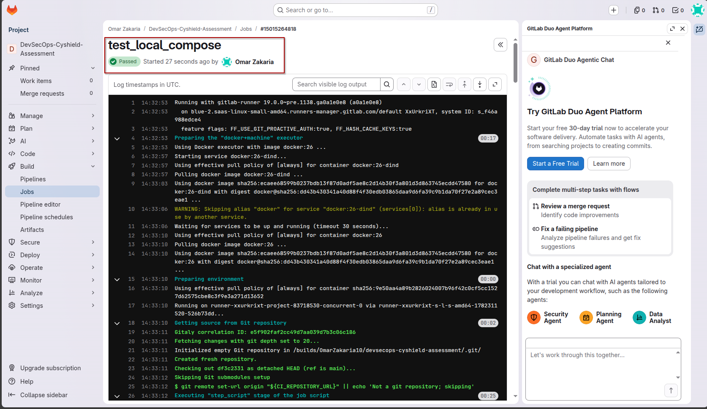
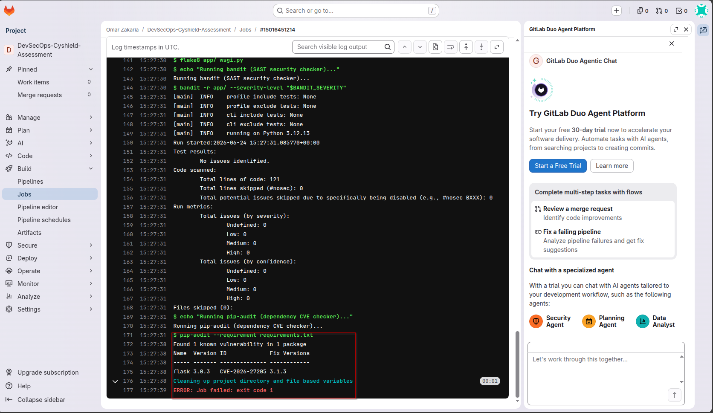
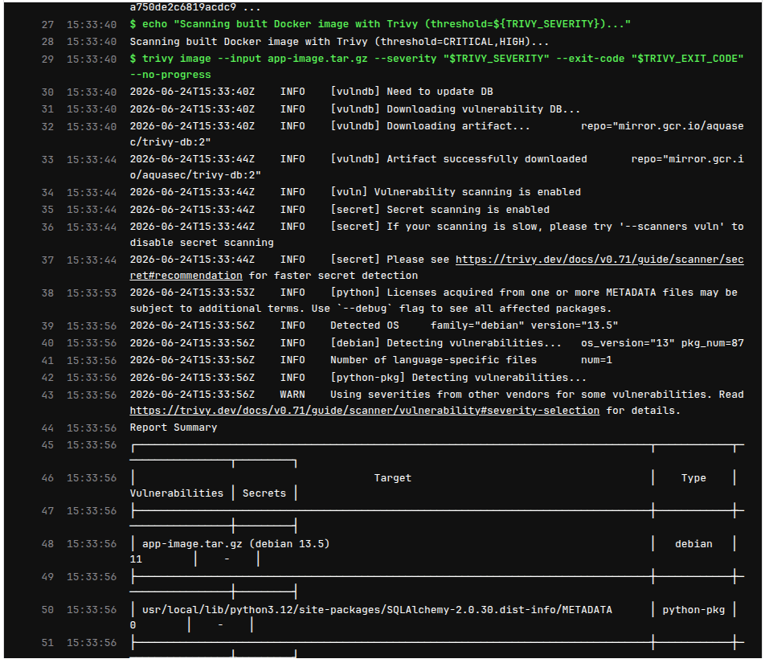

# Task 3: CI/CD Pipeline using GitLab CI/CD & Local Docker Compose

This directory contains a complete DevSecOps delivery pipeline configuration and a sample Python Flask application connected to a PostgreSQL database.

## 🚀 Application Architecture & Setup

The application is a Python (Flask/SQLAlchemy) REST API serving a Task Management endpoint. It utilizes a PostgreSQL database for persistence. 

* **Web Framework:** Flask / Gunicorn (production server)
* **Database ORM:** SQLAlchemy (Flask-SQLAlchemy)
* **Database Driver:** `psycopg2-binary`
* **Base Image:** `python:3.12-slim` (fast, lightweight, non-root user setup)
* **Database Container:** `postgres:16-alpine`

---

## 🛠️ Local Verification with Docker Compose

To verify the app locally, a multi-container environment has been defined in `docker-compose.yml`.

### How to Run Locally

1. Navigate to the task directory:
   ```bash
   cd task-3-cicd
   ```

2. Start the services (builds the Flask app and spins up PostgreSQL):
   ```bash
   docker compose up --build -d
   ```

3. To check logs:
   ```bash
   docker compose logs -f
   ```

4. To stop the containers and wipe volumes:
   ```bash
   docker compose down -v
   ```

---

## 🧪 What was Tested & Verification Results

A complete set of manual integration tests was run against the Docker Compose stack to verify connection persistence, route availability, database schemas, and input validation.

### 1. Database & Gunicorn Boot Verification
Checking `docker compose logs` confirmed that:
* The PostgreSQL database initialized and reached a healthy state.
* The Flask application successfully connected to PostgreSQL and initialized tables using SQLAlchemy.
* Gunicorn successfully spawned 2 workers on port 5000.

**Logs output:**
```text
taskapi_db   | 2026-06-24 14:01:51.160 UTC [1] LOG:  database system is ready to accept connections
taskapi_app  | [2026-06-24 14:01:55 +0000] [1] [INFO] Starting gunicorn 22.0.0
taskapi_app  | [2026-06-24 14:01:55 +0000] [1] [INFO] Listening at: http://0.0.0.0:5000 (1)
taskapi_app  | [2026-06-24 14:01:55 +0000] [7] [INFO] Booting worker with pid: 7
taskapi_app  | [2026-06-24 14:01:55 +0000] [8] [INFO] Booting worker with pid: 8
```

### 2. Service Health Endpoint Test
Verified that the health endpoint returns `200 OK`.

**Request:**
```bash
curl -s http://localhost:5000/health
```

**Response:**
```json
{"status":"ok"}
```

### 3. Task Creation (DB Write Test)
Sent a request to write a new record to the PostgreSQL database table. The server successfully processed the request, saved the record, and returned a status of `201 Created`.

**Request:**
```bash
curl -s -X POST http://localhost:5000/api/tasks \
  -H "Content-Type: application/json" \
  -d '{"title": "DevSecOps assessment completed successfully"}' | python3 -m json.tool
```

**Response:**
```json
{
    "created_at": "2026-06-24T14:02:25.677449+00:00",
    "done": false,
    "id": 1,
    "title": "DevSecOps assessment completed successfully"
}
```

### 4. Task Listing (DB Read Test)
Listed tasks to confirm that the created task persists in the database and is returned correctly.

**Request:**
```bash
curl -s http://localhost:5000/api/tasks | python3 -m json.tool
```

**Response:**
```json
[
    {
        "created_at": "2026-06-24T14:02:25.677449+00:00",
        "done": false,
        "id": 1,
        "title": "DevSecOps assessment completed successfully"
    }
]
```

### 5. Input Validation Error Handling (Security Gate)
Verified that the app refuses to write invalid/empty values to the database.

**Request:**
```bash
curl -s -X POST http://localhost:5000/api/tasks \
  -H "Content-Type: application/json" \
  -d '{"title": "   "}'
```

**Response:**
```text
HTTP 400 Bad Request: 'title' is required and must not be blank
```

---

## 🧪 GitLab CI/CD Verification Result

The GitLab CI/CD pipeline (`.gitlab-ci.yml`) was successfully run to test the jobs and verify the connectivity between the Flask app and the PostgreSQL database using docker compose. The execution succeeded.

Verification:


---

## 🛡️ Dependency Vulnerability Remediation (Second Run)

The second version of the GitLab CI/CD pipeline correctly caught a known dependency vulnerability (CVE-2026-27205) via the `pip-audit` scan:



This was successfully remediated by upgrading `flask` to `3.1.3` in `requirements.txt`.

## 🐳 Base Image OS Vulnerability Remediation (Third Run)

The third run of the pipeline resolved the python dependencies but failed during the `scan_image` stage because Trivy detected OS-level vulnerabilities inside the base Debian container:



To resolve this and ensure the pipeline remains actionable, the following fixes were implemented:
1. Updated the [Dockerfile](file:///media/omar/01DADC72FB780420/Projects/DevSecOps-Cyshield-assessment/task-3-cicd/Dockerfile) to run an OS upgrade (`apt-get update && apt-get upgrade -y`) to apply all available system security patches.
2. Configured the Trivy scanner to use the `--ignore-unfixed` flag to prevent blocking builds on upstream vendor issues that have no available security patch.

## 🛡️ CI/CD Pipeline Files & Docs

The delivery configurations are fully defined in the following files:
* **`.gitlab-ci.yml`**: Defines the stages and configuration for running Docker Compose & Curl tests inside DinD.
* **`Dockerfile`**: Minimalist multi-stage production image with rootless user configurations.
* **`PIPELINE.md`**: In-depth DevSecOps documentation explaining the security thresholds, caching strategies, and environment setup.


